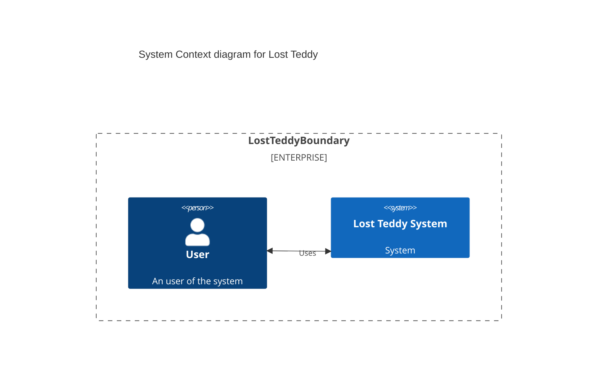

# System design

## Functional requirements

* uses must be able to login using a third-party login service (e.g. Facebook, Google...)
* + see use cases in README.md

## Non-functional requirements

## Back of the enveloppe estimates

### Daily active users

### Read-to-write ratio

### Usage patterns

Users should access the application only when they find a teddy bear, or just lost one.

It is expected that most of the traffic would happen when the user receives a notification
(someone having found a teddy bear, or an update).

### Peak ans seasonal events?

None expected

## Database

## API design

## Capacity planning

## High level design

Basic Algorithm
Data Flow
Tradeoffs
Alternatives
Network Protocols (WebSocket, SSE)

## Design deep dive

Single Point of Failures
Bottlenecks (Hotspots)
Concurrency
Monitoring, Alerting, Logging
Deployment
Security
